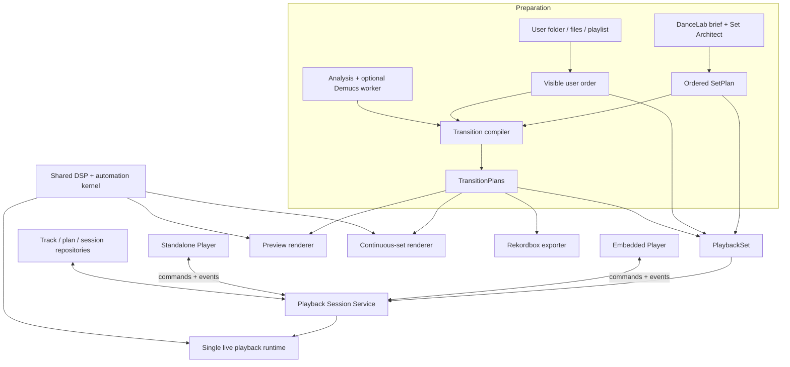

# Target Architecture

## System map



Set Architect owns repertoire selection for DanceLab-prepared sets. For
standalone input, user-visible queue order owns repertoire selection. The
Player runtime never silently substitutes a different next track.

## New bounded contexts

### `transitions/`

Turns a candidate decision into a durable executable contract.

```text
src/dancelab/transitions/
  __init__.py
  models.py          TransitionPlan and nested contracts
  compiler.py        EdgeDecision -> TransitionPlan
  timing.py          cue, duration, phrase and source-runway calculations
  profiles.py        strategy/profile -> automation knots
  guardrails.py      feasibility checks and safe fallback selection
  identity.py        deterministic plan/revision hashes
  revisions.py       immutable user revision application
```

Rules:

- no audio device ownership;
- no FastAPI or UI imports;
- deterministic compilation for identical inputs;
- missing evidence lowers confidence or blocks a mode;
- every automatic fallback is represented in the plan.

### `playback/`

Owns transport and real-time execution.

```text
src/dancelab/playback/
  __init__.py
  engine.py          public playback facade
  models.py          PlaybackSet, PlaybackSession and public state contracts
  session_service.py one authoritative runtime with multiple controllers
  sources.py         DanceLab project, playlist, file and folder adapters
  state.py           transport and deck state machine
  queue.py           ordered queue, history and readiness ownership
  decks.py           two-deck lifecycle
  clock.py           monotonic sample/beat clock
  scheduler.py       pre-roll and automation scheduling
  decoder.py         buffered local-file decoding
  prefetch.py        upcoming audio and plan preparation
  mixer.py           shared sample-block mixer facade
  timestretch.py     real-time backend adapter
  effects.py         approved bounded effect processors
  output.py          audio-device adapter
  controls.py        runtime control values and ownership arbitration
  controllers/
    base.py           controller adapter contract
    flx4.py           optional Pioneer DDJ-FLX4 MIDI/audio adapter
```

Rules:

- depends on `TransitionPlan`, never on ranking/scoring internals;
- consumes an ordered `PlaybackSet`; it does not own brief/set optimization;
- embedded and standalone clients attach to the same session;
- one session has one audio-device owner and one authoritative sample clock;
- no Demucs, network, filesystem discovery or JSON serialization on the audio
  callback;
- user transport and manual takeover always win;
- underrun or invalid-plan behavior is deterministic and audible-safe.

The console contract follows
`docs/fullstack-handoff/11_DDJ_FLX4_CONTROL_MAP.md`. The virtual console is P0;
physical FLX4 support is an adapter over the same commands/state and may ship
later.

### Refactored `preview/`

```text
src/dancelab/preview/
  renderer.py        TransitionPlan -> preview artifact
  dsp.py             non-real-time adapter over the shared mixing kernel
  audio_io.py        source reads and atomic WAV writes
  cache.py           plan/render hash -> artifact
  transition_simulation.py  temporary compatibility facade
```

The existing public functions remain until all callers migrate.

### Extended `storage/`

```text
src/dancelab/storage/
  transition_plan_repository.py
  transition_feedback_repository.py
  playback_session_repository.py
```

Plans and feedback are durable project data. Rendered previews and decoded
buffers are evictable cache.

`PlaybackSession` state is durable enough to reconnect a window after a UI
restart, but audio callback buffers are runtime-only.

### Extended `workflows/`

```text
src/dancelab/workflows/
  transition_planning.py
  transition_review.py
  transition_delivery.py
  playback_set.py
  automix_session.py
```

Workflows coordinate modules. They do not duplicate formulas or DSP.
`playback_set.py` adapts either a prepared DanceLab set or an explicit user
queue to the same Player input contract.

### Extended `export/`

```text
src/dancelab/export/
  transition_rekordbox.py
  continuous_mix.py
  manifest.py
```

Rekordbox export consumes supported plan fields and emits an explicit
capability report for fields it cannot express.

### `personalization/` — after production feedback exists

```text
src/dancelab/personalization/
  models.py
  aggregate.py
  cue_priors.py
  strategy_priors.py
```

This module may suggest priors only after held-out validation. It never
silently mutates production weights.

## Dependency direction

```text
core / ingestion / preprocessing / features / descriptors / stems
                                  |
                                  v
                         context / decision
                                  |
                                  v
                             transitions
                         /        |        \
                  preview      playback    export
                         \        |        /
                              workflows
                                  |
                             API / clients

validation and personalization consume outputs; production modules never
import validation.
```

Set planning remains upstream of playback:

```text
DanceLab path: brief -> SetPlan -> TransitionPlans -> PlaybackSet
Standalone:   user order -> TransitionPlans -> PlaybackSet
Player:       PlaybackSet -> deck execution
```

## Shared DSP boundary

Offline render and live playback must share:

- automation interpolation;
- fader and EQ semantics;
- channel gain law;
- clip prevention policy;
- block mixing;
- effect parameter meaning.

They may use different decoder and time-stretch backends. Parity tests compare
their output envelopes and timing, not necessarily byte-identical audio.

## Real-time invariants

- Audio callback receives prepared PCM blocks and immutable automation data.
- No allocation proportional to track length in the callback.
- No model loading or analysis in the callback.
- No blocking disk or network access in the callback.
- Parameters are scheduled against a sample clock derived from the compiled
  beat timeline.
- Pause, seek and manual takeover have explicit state transitions.
- Attaching or detaching a Player window does not alter the audio timeline.
- Conflicting controller commands are serialized by the session service.
- Physical knob pickup/soft takeover is resolved outside the audio callback.
- UI and MIDI adapters receive authoritative runtime values for LEDs/meters.
- A missing/invalid plan falls back to gapless or a bounded crossfade.
- The runtime never invents beat certainty that the analysis did not provide.

## Deployment shape

Phase 1 may run the Python engine as a local service for development speed.
The embedded and standalone windows connect through one local session service.
The UI must not couple itself to Python object identity or internal file
layouts.

Launching the standalone Player from DanceLab passes a `session_id`, not a
copy of the queue. The new window subscribes to the authoritative snapshot and
events. It never opens a second audio device for that session.

Before public live playback, benchmark the audio boundary on the target
MacBook Air M4. If Python cannot meet the callback budget reliably, keep
analysis/planning in Python and move only the real-time kernel/device layer to
a native component. `TransitionPlan` remains the language-neutral boundary.
