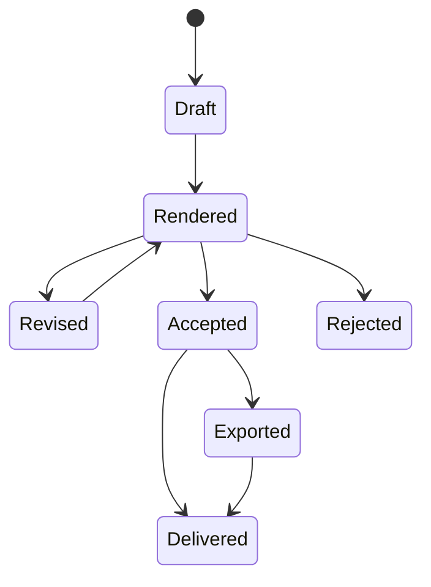

# TransitionPlan Contract

## Purpose

`TransitionPlan` is the single source of truth for executing one A→B
transition. It is produced once, can be revised immutably, and is consumed by
preview, live playback, full-set rendering and exporters.

An `EdgeDecision` answers whether and why a transition is suitable. A
`TransitionPlan` answers exactly how to perform it.

The Player does not receive a loose list of plans. It receives an ordered
`PlaybackSet` that references one plan per adjacent pair.

## PlaybackSet container

The first implementation belongs in `src/dancelab/playback/models.py`.

```python
class PlaybackTrack(BaseModel):
    position: int
    track_id: str
    source_path: str
    source_checksum: str | None
    readiness: Literal[
        "scanned", "quick_ready", "deep_ready",
        "playback_ready", "pending", "blocked"
    ]
    warnings: list[str]

class PlaybackSet(SchemaVersionedOutput):
    playback_set_id: str
    revision: int
    source_kind: Literal[
        "dancelab_project", "playlist", "selected_files", "folder"
    ]
    source_reference: str | None
    ordered_tracks: list[PlaybackTrack]
    transition_plan_revision_ids: list[str]
    created_at_utc: str
```

Invariants:

- `transition_plan_revision_ids[n]` describes
  `ordered_tracks[n] -> ordered_tracks[n + 1]`;
- imported playlist order is preserved;
- folder order is deterministic and visible before playback;
- only explicit user action or Set Architect may reorder tracks;
- queue revision and transition plan adjacency are validated atomically;
- the Player never calls next-track recommendation to replace a queue item.

## Draft model

The first implementation belongs in `src/dancelab/transitions/models.py`.
Field names below are the contract proposal; changing them requires a schema
version decision.

```python
class TransitionPlan(SchemaVersionedOutput):
    plan_id: str
    revision_id: str
    parent_revision_id: str | None
    plan_hash: str

    status: Literal[
        "draft", "rendered", "accepted", "rejected",
        "exported", "delivered"
    ]

    from_track: TrackAnchor
    to_track: TrackAnchor
    timing: TransitionTiming
    performance: TransitionPerformance
    automation: TransitionAutomation
    safety: TransitionSafety
    provenance: TransitionPlanProvenance
    review: TransitionReview | None
```

### TrackAnchor

```python
class TrackAnchor(BaseModel):
    track_id: str
    source_path: str
    source_checksum: str | None
    cue_sec: float
    window_start_sec: float
    window_end_sec: float
    cue_source: str
    bpm: float | None
    beatgrid_reliable: bool
```

Source checksum protects against playing a plan against a changed file.

### TransitionTiming

```python
class TransitionTiming(BaseModel):
    duration_beats: int | None
    duration_sec: float
    master_bpm: float | None
    playback_rate_a: float
    playback_rate_b: float
    tempo_strategy: str
    grid_beats: int
    phrase_locked: bool
```

If reliable beat timing is unavailable, beat-derived claims are nullable and
the compiler selects a time-based safe strategy or requires review.

### TransitionPerformance

```python
class TransitionPerformance(BaseModel):
    strategy: TransitionStrategy
    blend_profile: BlendProfile
    alternative_strategies: list[TransitionStrategy]
    effects: list[EffectPlan]
```

`effects` is empty in the current runtime. `echo_out` is a planning label, not
an executable processor; compile it to a review flag and a supported EQ/fader
fallback. Add an effect to the allow-list only after its DSP and safety tests
exist.

### TransitionAutomation

```python
class AutomationKnot(BaseModel):
    beat: float
    value: float

class TransitionAutomation(BaseModel):
    fader_a: list[AutomationKnot]
    fader_b: list[AutomationKnot]
    low_a: list[AutomationKnot]
    mid_a: list[AutomationKnot]
    high_a: list[AutomationKnot]
    low_b: list[AutomationKnot]
    mid_b: list[AutomationKnot]
    high_b: list[AutomationKnot]
```

Automation values are normalized to `[0, 1]`. EQ values describe gain
semantics owned by the DSP contract; they are not assumed to be Rekordbox
knob positions.

### TransitionSafety

```python
class TransitionSafety(BaseModel):
    executable: bool
    live_playback_allowed: bool
    requires_manual_listen: bool
    fallback_mode: Literal["none", "gapless", "short_crossfade", "hard_cut"]
    hard_blocks: list[str]
    warnings: list[str]
```

`executable` means the plan is internally complete. It does not mean the
transition is artistically validated.

### Provenance and review

```python
class TransitionPlanProvenance(BaseModel):
    engine_version: str
    schema_version: str
    compiler_version: str
    edge_model_version: str
    source_edge_hash: str
    analysis_ids: list[str]
    generated_at_utc: str

class TransitionReview(BaseModel):
    verdict: Literal[
        "accepted", "accepted_with_changes", "rejected",
        "needs_manual_listen"
    ]
    note: str
    reviewed_at_utc: str
```

## Identity and revisions

- `plan_id` identifies the A→B planning lineage.
- `revision_id` identifies one immutable revision.
- `parent_revision_id` forms the revision chain.
- `plan_hash` is derived from execution-relevant normalized content, excluding
  timestamps and user-interface state.
- Applying an edit creates a new revision; it never mutates the original.
- Preview cache keys include `plan_hash`.
- A changed source checksum invalidates execution until the plan is recompiled
  or explicitly reviewed.

## State lifecycle



Rendering is allowed for a draft. Live AutoMix delivery requires
`live_playback_allowed`; product policy may additionally require an accepted
revision.

For a DanceLab project, accepted plan revisions are passed through unchanged.
For a standalone user queue, the compiler may create executable automatic
plans for adjacent tracks without a brief. Their provenance must say that
WITH WHAT came from explicit queue order rather than Set Architect.

## Compiler inputs

Minimum:

- Track A and B `AnalysisResult`;
- one `EdgeDecision`;
- source paths/checksums;
- explicit compiler policy;
- target capabilities (`preview`, `live`, `continuous_render`,
  `rekordbox_export`).

Compiler policy includes default duration, max tempo adjustment, fallback
preference and whether unreviewed plans may play automatically.

## Guardrails

Compilation fails or degrades honestly when:

- either source file is absent or changed;
- cue/window bounds exceed source duration;
- requested duration lacks source runway;
- playback rate exceeds configured limits;
- hard-blocked decision is requested as a standard blend;
- automation curves are incomplete, non-monotonic in time or out of range;
- a phrase-locked plan lacks a reliable time mapping;
- required effect or time-stretch capability is unavailable.

## Rekordbox mapping

Rekordbox export is lossy:

- track order maps directly;
- supported cue positions map directly after verification;
- strategy, EQ/fader curves and most effects do not map to ordinary playlist
  XML;
- unsupported fields stay in a DanceLab sidecar manifest;
- export response reports `mapped_fields`, `sidecar_fields` and
  `unsupported_fields`.

The exporter must never imply that Rekordbox will execute automation it only
stores in the sidecar.
