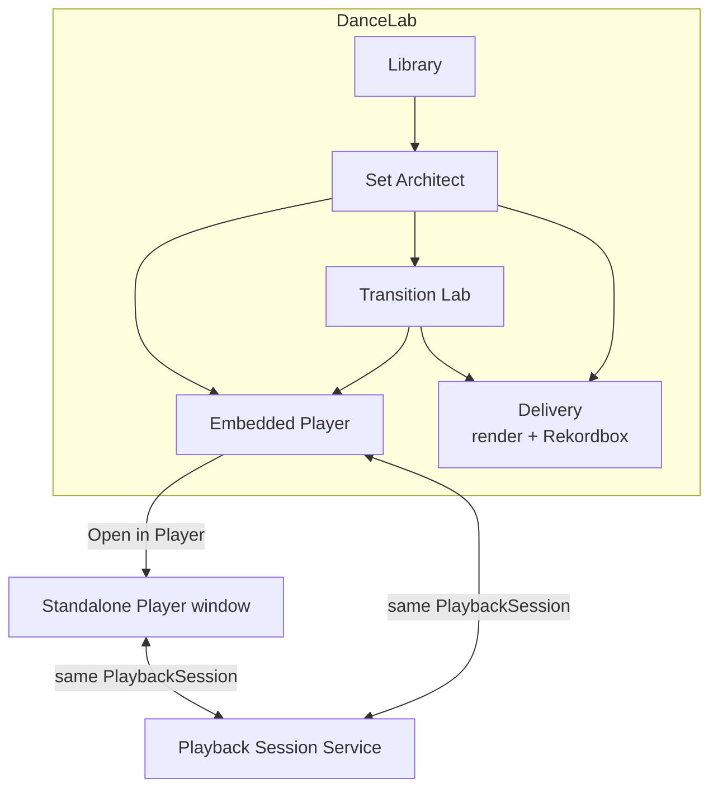
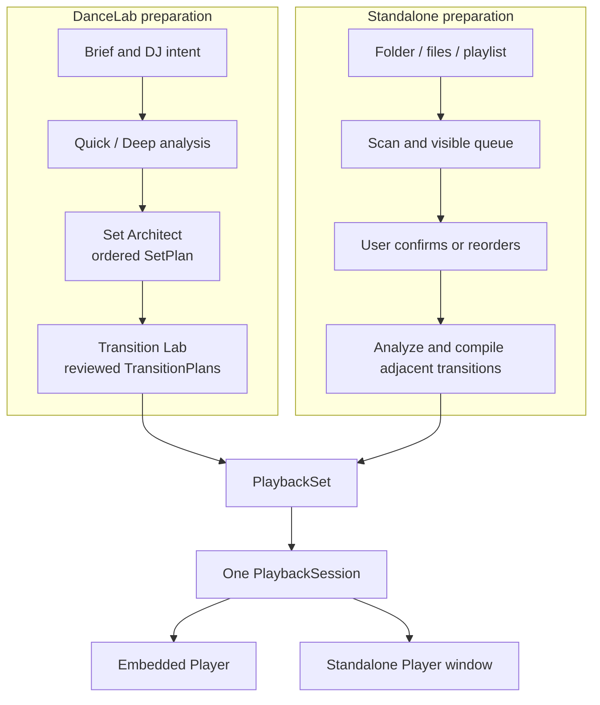
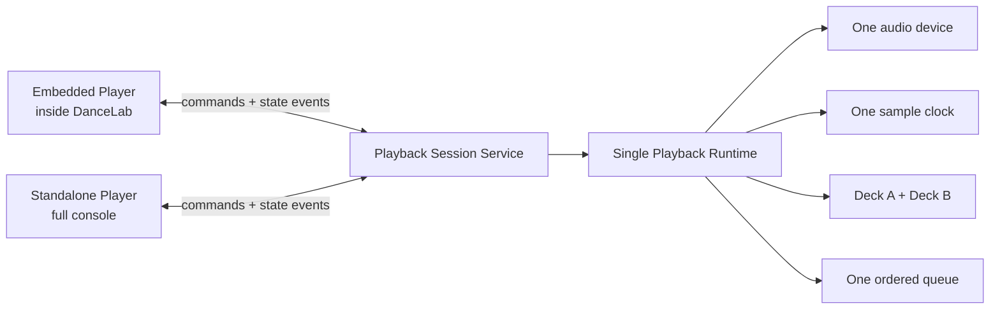
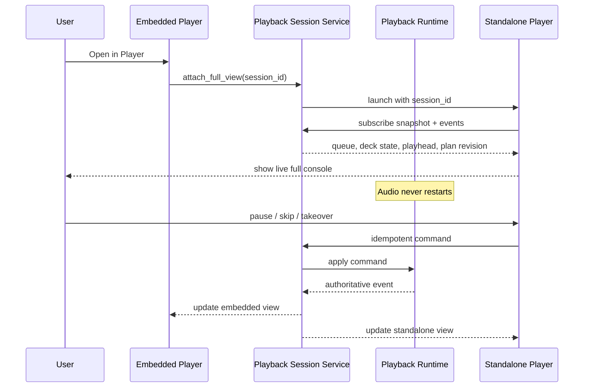
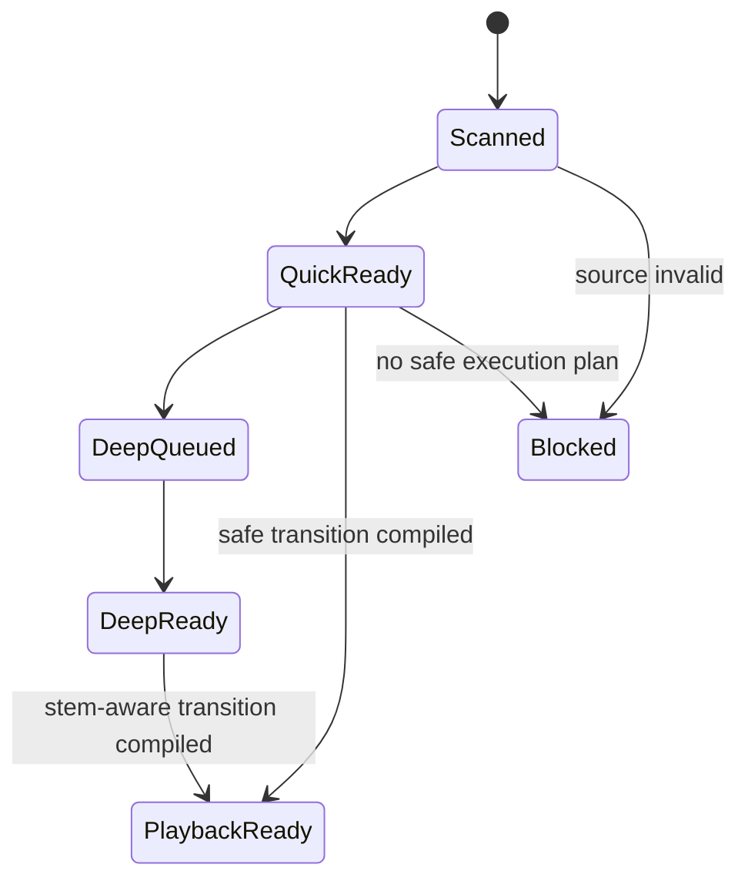
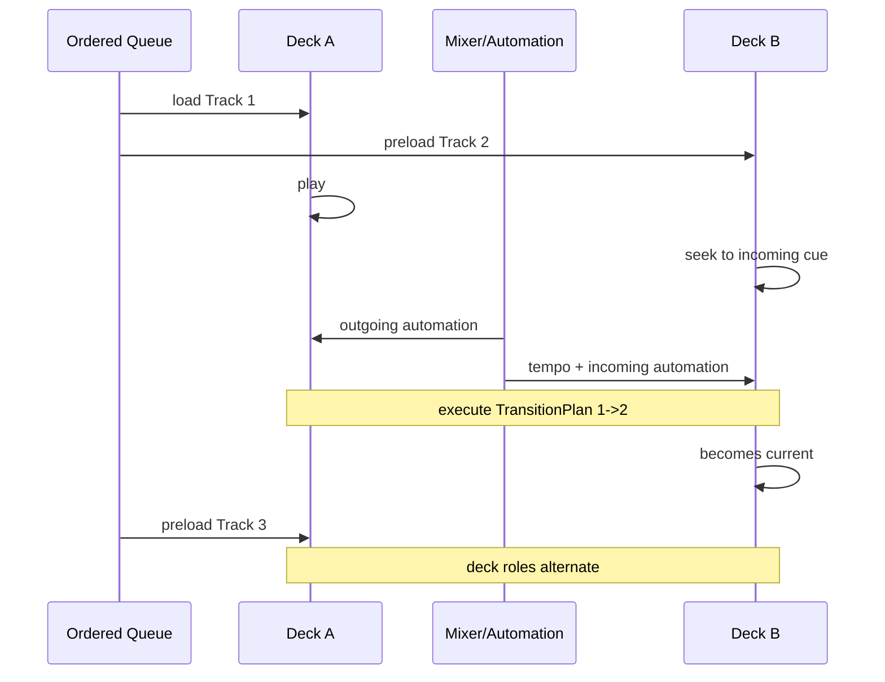

# Player Product Flow

Status: canonical product behavior for implementation

## Core rule

DanceLab Player is an automatic two-deck mixer for an **ordered queue**. It
does not care where the tracks came from and does not silently select a
different next track.

```text
Input owns WITH WHAT
Player prepares/receives WHERE + HOW
Playback runtime executes the plan
```

## Product workspace map



Set Architect, Transition Lab, Embedded Player and Delivery are DanceLab
workspaces. The standalone Player is a full console window linked to the same
runtime, not a detached product copy.

## Two entry paths



The two paths converge before playback. Player execution is identical after a
valid `PlaybackSet` exists.

## Linked-window model



Invariant: multiple views may exist, but exactly one runtime is authoritative
for audio, playhead, deck state and automation position.

## Open in Player sequence



Opening the standalone window attaches a controller. It does not clone the
session, reload the track or reacquire the device.

## Playback queue semantics

### DanceLab-prepared

The queue contains:

- ordered track references from `SetPlan`;
- accepted `TransitionPlan` revision for each adjacent pair;
- warnings and readiness;
- source/project identity.

The Player is an execution preview of what DanceLab designed.

### Standalone

The user supplies:

- an ordered playlist;
- selected files;
- or a folder that becomes a visible deterministic list.

The Player:

1. scans metadata and validates paths;
2. displays the queue immediately;
3. schedules analysis;
4. prepares transitions only between adjacent items;
5. begins once the first execution runway is ready;
6. continues analysis/prefetch ahead without blocking audio.

Folder import never implies smart set ordering. An explicit user reorder or
handoff to Set Architect is required to change repertoire order.

## Analysis readiness



The runtime should normally maintain at least the current track, next track
and one following track in a prepared state. Exact lookahead is configurable
and benchmarked.

Deep/Demucs analysis:

- never runs on the audio callback;
- yields or pauses when it threatens playback stability;
- may finish before playback or continue ahead in a bounded worker;
- is not required for basic playback;
- improves transition evidence when ready in time.

## Automatic deck cycle



## Console model

```text
┌────────────────────── DECK A ──────────────────────┐
│ title · BPM · rate · phase · cue · waveform        │
│ HIGH   MID   LOW               channel fader       │
└────────────────────────────────────────────────────┘

                  MASTER METERS
                   CROSSFADER
            AUTOMIX · FADE NOW · TAKEOVER

┌────────────────────── DECK B ──────────────────────┐
│ title · BPM · rate · phase · cue · waveform        │
│ HIGH   MID   LOW               channel fader       │
└────────────────────────────────────────────────────┘

PLAYLIST / AUTOMIX QUEUE
  playing
  loaded next
  analyzed and ready
  analysis pending
  blocked with reason
```

Controls should visibly follow the active `TransitionPlan`. The UI is a
faithful console representation of the runtime, not an animation that guesses
what the engine is doing.

The canonical console semantics and control-by-control mapping are defined in
[11_DDJ_FLX4_CONTROL_MAP.md](11_DDJ_FLX4_CONTROL_MAP.md). FLX4 is the
interaction reference; DanceLab is not required to copy its branding or exact
industrial design.

## Relationship to Mixxx

The local R&D source
`/Users/jantrybus/Desktop/AI/RnD-DanceLab-Pro/notes/mixxx-manual-2.5-en.pdf`
documents useful baseline behavior:

- an Auto DJ queue is a special ordered playlist;
- tracks may be loaded from a playlist, crate, library or files;
- the first tracks are loaded into opposing decks;
- Auto DJ continues until the queue is empty;
- intro/outro sections may align transition timing;
- Auto DJ controls the crossfader.

DanceLab keeps that source-agnostic queue/deck model but extends execution
with phrase evidence, tempo planning, low/mid/high automation, line faders,
stem-aware collision risk and explicit `TransitionPlan` provenance.

## Product actions

Embedded Player:

- Open in Player;
- open current seam in Transition Lab;
- open queue in Set Architect;
- start/stop AutoMix;
- basic transport and status.

Standalone Player:

- attach to an existing DanceLab session;
- start a new local session from files/playlist/folder;
- show the full console;
- explicit queue reorder;
- manual takeover and resume;
- return/open the session in DanceLab.

## Non-goals

- no brief inside the Player;
- no silent playlist optimization;
- no random library selection by default;
- no duplicate audio runtime when two windows are open;
- no Deep analysis on the audio callback;
- no UI-authored fake playhead or fader state.
