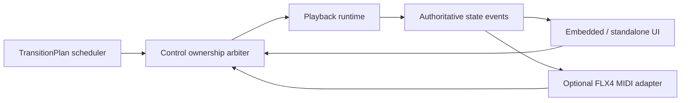
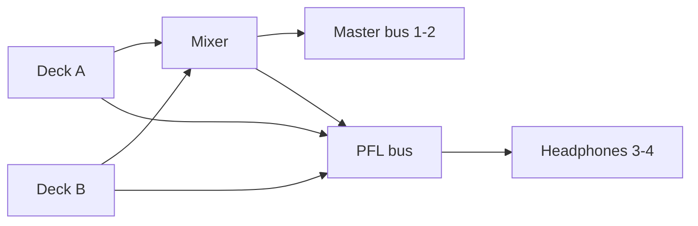
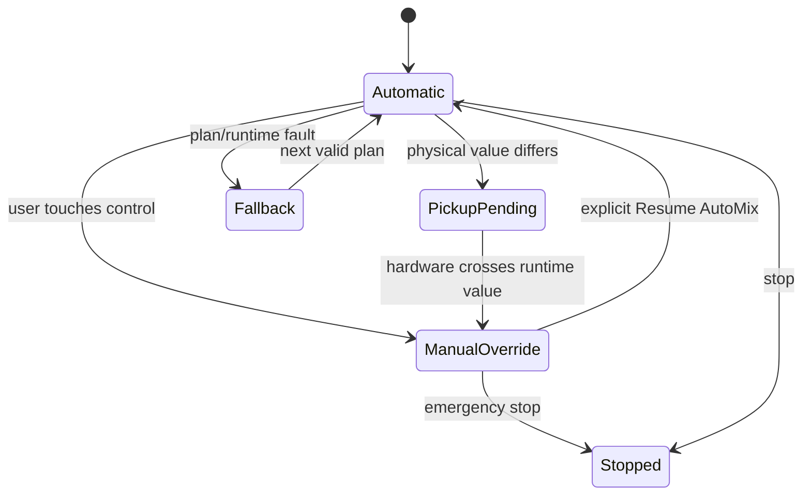

# DDJ-FLX4 Control Map

Status: target console contract

Reference: [Mixxx 2.5 - Pioneer DDJ-FLX4](https://manual.mixxx.org/2.5/en/hardware/controllers/pioneer_ddj_flx4)

The referenced Mixxx mapping states firmware version 1.02.

## Purpose

Pioneer DDJ-FLX4 is the behavioral reference for DanceLab Player's two-deck
console. This document maps every control group from the official Mixxx 2.5
mapping to:

- Player runtime state;
- `TransitionPlan` automation;
- user/manual takeover commands;
- physical-controller integration priority.

This is a semantic reference, not a visual or trademark clone. The Player may
use DanceLab's own visual language while keeping a layout familiar to DJs.

## Two implementation layers

### Required: virtual console

The embedded and standalone Player display real runtime state using FLX4-like
deck and mixer semantics. Controls move because authoritative audio state
changes, not because the UI plays an unrelated animation.

### Optional: physical FLX4 integration

The same commands and state may later connect to a physical controller through
MIDI. The official Mixxx page states that FLX4 is USB audio/MIDI class
compliant on macOS without a driver. Physical support is a separate adapter;
it must not leak MIDI concepts into the audio engine.

## Console topology

```text
┌────────────────────── BROWSER / QUEUE ──────────────────────┐
│ rotary · load A · load B · ordered AutoMix queue · readiness│
└──────────────────────────────────────────────────────────────┘

┌──────────────── DECK A ───────────────┐ ┌──────────────── DECK B ───────────────┐
│ sync · loop · jog · tempo · waveform  │ │ sync · loop · jog · tempo · waveform  │
│ hot cues · beat jump · play · cue     │ │ hot cues · beat jump · play · cue     │
└───────────────────────────────────────┘ └───────────────────────────────────────┘

┌──────────────────────────── MIXER ───────────────────────────┐
│ trim  high  mid  low  filter  PFL  meters  channel faders   │
│ headphones cue/master       crossfader       master meters  │
└──────────────────────────────────────────────────────────────┘

┌────────────────────────── BEAT FX ───────────────────────────┐
│ route A/B/both · select · beat/focus · depth · on/off        │
└──────────────────────────────────────────────────────────────┘
```

## State ownership

Every automatable control exposes its value and owner:

```python
class ControlOwnership(str, Enum):
    plan = "plan"
    user = "user"
    hardware = "hardware"
    fallback = "fallback"
    pickup_pending = "pickup_pending"

class RuntimeControl(BaseModel):
    value: float
    owner: ControlOwnership
    automated: bool
    touched: bool
    last_command_id: str | None
```

Control flow:



Rules:

- automatic plan execution owns controls until explicit user/hardware input;
- a touched control enters manual override;
- physical knobs use soft takeover/pickup before changing a different runtime
  value;
- returning to AutoMix uses a bounded ramp, never a discontinuous jump;
- one command is applied once and broadcast to every attached view;
- master safety/stop commands always win.

## Browser and queue

| FLX4 control | DanceLab Player mapping | Runtime/API | Priority |
|---|---|---|---|
| LOAD A | Explicitly load selected queue item into Deck A | `load_deck(A, queue_item_id)` | P1 manual |
| LOAD B | Explicitly load selected queue item into Deck B | `load_deck(B, queue_item_id)` | P1 manual |
| Rotary turn | Move selection in visible queue/library | client selection; no audio mutation | P0 |
| Rotary press | Toggle focus between queue and source/navigation panel | client focus | P1 |
| SHIFT + rotary | Parallel waveform zoom | client waveform scale | P1 |

AutoMix loads the next ordered item automatically. LOAD buttons are explicit
manual overrides and never cause the engine to select a different recommendation.

## Deck controls

| FLX4 control | Automatic meaning | Manual meaning | Runtime state/command | Priority |
|---|---|---|---|---|
| BEAT SYNC | show plan tempo/phase sync | enable sync to the opposite deck | `sync_enabled`, `sync_leader` | P0 |
| Hold BEAT SYNC | keep scheduled tempo/phase relation | sync lock | `sync_locked` | P1 |
| SHIFT + BEAT SYNC | none | cycle permitted tempo range | `tempo_range_pct` | P2 |
| TEMPO slider | visibly follows plan playback rate | override deck playback rate | `playback_rate` | P0 |
| PLAY/PAUSE | scheduler starts incoming deck at cue | play/pause selected deck | `deck.playing` | P0 |
| CUE | show/seek prepared cue | cue-mode transport command | `cue_sec`, `cue_state` | P0 |
| Jog top | no automatic movement required | scratch/absolute seek and takeover | `seek/scratch` | P2 |
| Jog outer | show optional phase correction | temporary phase/tempo nudge | `phase_nudge` | P1 |
| CUE/LOOP CALL > | plan may display active loop | double loop size | `loop_double` | P1 |
| CUE/LOOP CALL < | plan may display active loop | halve loop size | `loop_halve` | P1 |
| SHIFT + CALL > | none | jump 32 beats forward | `beat_jump(+32)` | P1 |
| SHIFT + CALL < | none | jump 32 beats backward | `beat_jump(-32)` | P1 |
| 4BEAT/EXIT | use plan-declared safety loop when present | toggle four-beat/current loop | `loop_toggle` | P1 |
| SHIFT + 4BEAT/EXIT | none | return to loop start and stop | `loop_reloop_stop` | P2 |
| IN | display plan loop/cue boundary | quantized loop-in | `loop_in_sec` | P1 |
| OUT | display plan loop/cue boundary | quantized loop-out | `loop_out_sec` | P1 |
| SHIFT + IN/OUT | none | arm jog adjustment of boundary | `loop_adjust_mode` | P2 |
| SHIFT | none | secondary-command modifier | controller adapter only | P1 |

### Sync representation

`TransitionPlan.timing` provides master BPM and playback rates. Runtime state
adds observed phase:

```python
class DeckSyncState(BaseModel):
    source_bpm: float | None
    effective_bpm: float | None
    playback_rate: float
    sync_enabled: bool
    sync_locked: bool
    phase_error_ms: float | None
    beatgrid_reliable: bool
```

The UI must not display a perfect sync lock when the grid is unreliable.

## Pad modes

### Hot Cue

| Pad action | Mapping |
|---|---|
| unlit pad | set cue at current position |
| lit pad | jump to cue; stopped deck may momentarily preview |
| SHIFT + lit pad | clear cue after conflict/safety validation |

Pads 1–8 map to the current cue contract and Rekordbox-compatible slots where
supported. DanceLab must keep cue origin and verification status visible.

### Beat Loop

Pad sizes follow the familiar FLX4/Mixxx grid:

```text
1/4 · 1/2 · 1 · 2
4   · 8   · 16 · 32 beats
```

Pressing a pad toggles the corresponding quantized loop. Loop execution
requires a usable beat timeline; otherwise the command is disabled with a
reason rather than approximated silently.

### Beat Jump

Default pads:

```text
-1 · +1 · -2 · +2
-4 · +4 · -8 · +8 beats
```

Beat jump is a manual rehearsal/takeover function. It is not part of normal
automatic transition execution.

### PAD FX

Deferred and hidden. Do not show PAD FX until effect DSP, timing and safety
semantics are implemented and tested.

### Sampler

Deferred. Sampler playback is outside the first automatic two-deck milestone.
The UI may reserve the pad mode but must label it unavailable rather than fake
loaded samples.

## Mixer mapping

| FLX4 control | DanceLab automation mapping | Manual behavior | Runtime field | Priority |
|---|---|---|---|---|
| TRIM | optional loudness/pre-gain plan | adjust prefader deck gain | `trim_gain_db` | P0 |
| HIGH | `automation.high_a/high_b` | manual high-band override | `eq_high` | P0 |
| MID | `automation.mid_a/mid_b` | manual mid-band override | `eq_mid` | P0 |
| LOW | `automation.low_a/low_b` | manual low-band override | `eq_low` | P0 |
| CFX/filter | none in current runtime | hidden until filter DSP exists | none | deferred |
| Channel fader A/B | `automation.fader_a/fader_b` | manual channel-level override | `channel_fader` | P0 |
| Crossfader | derived/explicit transition curve | manual A/B blend override | `crossfader` | P0 |
| Channel meter | measured prefader signal | read-only | `prefader_peak/rms` | P0 |
| Headphone CUE | no audience output effect | toggle deck PFL | `pfl_enabled` | P1 |
| SHIFT + headphone CUE | plan uses quantization policy | toggle quantize | `quantize_enabled` | P1 |
| HEADPHONES MIXING | none | blend cue/master in headphones | `headphone_mix` | P1 |
| HEADPHONES LEVEL | none | headphone output level | device output state | P1 |
| MASTER level | final output safety policy | master level | device/master state | P0 |
| MASTER CUE | none | route master to headphones | device/PFL state | P2 |
| Microphone level | outside automatic mix plan | hardware/manual only | not in v1 runtime | deferred |
| Smart CFX | no default mapping | reserved | none | deferred |
| Smart Fader | no hidden repertoire logic | reserved for an explicit AutoMix macro decision | none | deferred |

The Mixxx FLX4 mapping notes that the physical MASTER, MASTER CUE and
microphone path can be hardware-implemented. DanceLab's virtual console still
needs explicit master/headphone state, while a physical adapter must respect
what the device exposes back to software.

### Crossfader derivation

DanceLab currently has independent channel fader curves. The runtime may:

1. execute channel faders directly and show a neutral crossfader; or
2. compile an explicit crossfader curve when the selected profile requires it.

It must not animate both as though both are affecting sound if only one path is
actually used.

## Beat FX mapping

Beat FX is deferred and must not be rendered as an active console section in
the current product. The engine currently executes phrase-locked tempo,
channel-fader and three-band EQ automation, but has no echo, delay, reverb or
channel-filter DSP. `echo_out` remains a planning label only and must compile to
a supported blend or a review flag.

When an effect processor and its safety tests exist, this section may be
restored with explicit routing, wet/dry, parameter ownership, soft takeover and
a kill/reset path.

## Audio routing

Reference routing:

| Output | FLX4 channels | DanceLab role |
|---|---:|---|
| Master | 1–2 | audience/main output |
| Headphones | 3–4 | PFL and master/cue blend |

Target Player routing:



The physical FLX4 microphone jack is not part of the first DanceLab capture or
broadcast contract.

## Virtual console state

```python
class DeckState(BaseModel):
    deck_id: Literal["A", "B"]
    track_id: str | None
    title: str | None
    playing: bool
    position_sec: float
    duration_sec: float | None
    cue_sec: float | None
    sync: DeckSyncState
    loop: LoopState
    hot_cues: list[HotCueState]
    pad_mode: str
    trim: RuntimeControl
    high: RuntimeControl
    mid: RuntimeControl
    low: RuntimeControl
    filter: RuntimeControl
    channel_fader: RuntimeControl
    pfl_enabled: bool
    prefader_peak: float

class MixerState(BaseModel):
    crossfader: RuntimeControl
    master_peak_left: float
    master_peak_right: float
    headphone_mix: float
    automix_enabled: bool
    manual_takeover: bool

class PlayerConsoleState(BaseModel):
    session_id: str
    revision: int
    deck_a: DeckState
    deck_b: DeckState
    mixer: MixerState
    effects: list[EffectState]
    queue: list[QueueItemState]
    active_transition_revision_id: str | None
```

Both windows render this authoritative state. They do not maintain separate
deck models.

## Automatic versus manual behavior



Manual takeover is per session and may also be tracked per control. Product
policy must specify whether untouched controls continue their automation while
one control is overridden.

## P0 console subset

The first credible automatic console requires:

- two waveforms and deck identities;
- play/pause, cue and effective BPM/rate;
- sync/phase/reliability state;
- high/mid/low;
- two channel faders;
- crossfader;
- channel/master meters;
- AutoMix, fade now, skip and takeover;
- visible queue and readiness;
- hot cues used by active plans;
- master and headphone routing configuration.

Loops, beat jump, full effects, jog/scratch and samplers may follow without
blocking the core automatic-DJ milestone.

## Acceptance checks

- every visible moving control is backed by runtime state;
- automatic EQ/fader curves match the active `TransitionPlan`;
- manual movement changes the audio path, not only the UI;
- embedded and standalone views show identical control values;
- one physical input produces one idempotent command;
- soft takeover prevents parameter jumps;
- unreliable beatgrid disables or qualifies beat-dependent controls;
- queue LOAD never silently changes the order;
- effect kill always returns wet/dry to its safe value;
- Master and Headphones routes are independently testable;
- detaching the physical controller does not stop software playback;
- attaching the standalone window or FLX4 never creates another audio runtime.
